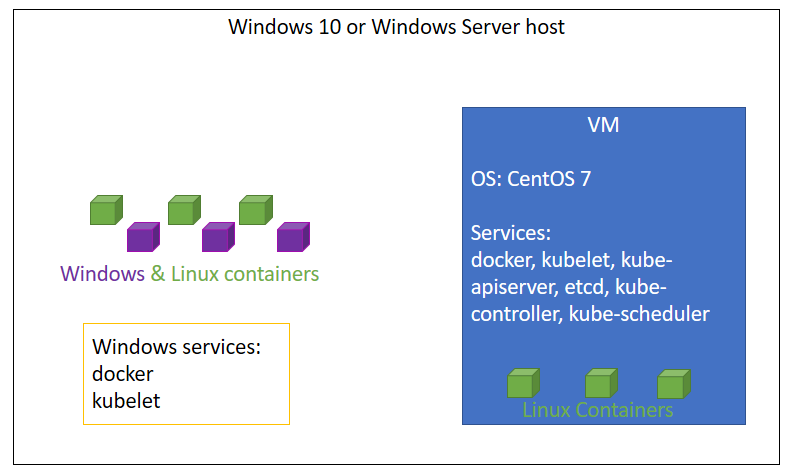

## Building a 1-node Linux-based cluster with Minikube on Windows 10

Minikube sets up a quick 1-node Linux-only Kubernetes cluster in a VM. However, it can't add other nodes such as a Windows host. If you just want to run a few Linux containers to try Kubernetes out, this is a good way to start.

The download links & full guide are at https://github.com/kubernetes/minikube , but here's a brief summary.


### Starting up Minikube

```powershell
minikube start --vm-driver hyperv
```

```none
Starting local Kubernetes v1.7.0 cluster...
Starting VM...
Getting VM IP address...
Moving files into cluster...
Setting up certs...
Starting cluster components...
Connecting to cluster...
Setting up kubeconfig...
Kubectl is now configured to use the cluster.
```

### Run first container

```powershell
kubectl run hello-minikube --image=gcr.io/google_containers/echoserver:1.4 --port=8080

>kubectl get pod
NAME                             READY     STATUS    RESTARTS   AGE
hello-minikube-180744149-m4m1n   1/1       Running   0          2m

kubectl expose deployment hello-minikube --type=NodePort

>minikube service hello-minikube --url
http://192.168.1.156:31007
PS 08/05/2017 16:21:32 C:\minikube
>(Invoke-WebRequest -UseBasicParsing $(minikube service hello-minikube --url)).Content
CLIENT VALUES:
client_address=172.17.0.1
command=GET
real path=/
query=nil
request_version=1.1
request_uri=http://192.168.1.156:8080/

SERVER VALUES:
server_version=nginx: 1.10.0 - lua: 10001

HEADERS RECEIVED:
host=192.168.1.156:31007
user-agent=Mozilla/5.0 (Windows NT; Windows NT 10.0; en-US) WindowsPowerShell/5.1.15063.483
BODY:
-no body in request-
PS 08/05/2017 16:22:01 C:\minikube

```


### Getting access to services running under Minikube

```
>minikube service list
|-------------|----------------------|----------------------------|
|  NAMESPACE  |         NAME         |            URL             |
|-------------|----------------------|----------------------------|
| default     | hello-minikube       | http://192.168.1.156:31007 |
| default     | kubernetes           | No node port               |
| kube-system | kube-dns             | No node port               |
| kube-system | kubernetes-dashboard | http://192.168.1.156:30000 |
|-------------|----------------------|----------------------------|
```


## Building a 2 node Windows/Linux cluster

Once you have some of the basics down with Kubernetes, it's time to build a larger cluster with both Windows & Linux nodes.



This tutorial will create a Kubernetes master running in a Linux VM, which can also be used to run containers. Once the master is up, the Windows host will be added to the same cluster. The same steps could be used to join other existing machines as well, or you could create even more VMs to join as needed.


### Prerequisites

- Windows 10 Anniversary Update, Windows Server 2016 or later
- Hyper-V role installed - [Quick Start here](https://docs.microsoft.com/en-us/virtualization/#pivot=main&panel=windows)
- [Vagrant](https://www.vagrantup.com/downloads.html) 1.9.3 or later for Windows 64-bit


### Setting up the Linux master with Centos 7

Get a clean Centos 7 image up

```powershell
vagrant box add centos/7
# Choose hyperv provider when prompted
vagrant init centos/7
vagrant up
```


This also has Vagrant provisioner steps to:

- Install docker from Centos package repo
- Install latest versions of kubectl & kubeadm from Kubernetes package repo
- Initialize a simple cluster with `kubeadm init`

> TODO: this gets docker-1.12.6-32.git88a4867.el7.centos.x86_64 - good/bad?


### Starting the Kubernetes master

The last provisioner step in the `Vagrantfile` runs `install-k8s.sh` which will install all the packages and create a Kubernetes master. These steps were adapted from the [official guide](https://kubernetes.io/docs/setup/independent/create-cluster-kubeadm/)

After you've run `vagrant up` or `vagrant provision` - the last step will look something like this:


```none
[kubeadm] WARNING: kubeadm is in beta, please do not use it for production clusters.
[init] Using Kubernetes version: v1.7.3
[init] Using Authorization modes: [Node RBAC]
[preflight] Running pre-flight checks
[preflight] Some fatal errors occurred:
        user is not running as root
[preflight] If you know what you are doing, you can skip pre-flight checks with `--skip-preflight-checks`
[vagrant@localhost ~]$ sudo kubeadm init
[kubeadm] WARNING: kubeadm is in beta, please do not use it for production clusters.
[init] Using Kubernetes version: v1.7.3
[init] Using Authorization modes: [Node RBAC]
[preflight] Running pre-flight checks
[kubeadm] WARNING: starting in 1.8, tokens expire after 24 hours by default (if you require a non-expiring token use --token-ttl 0)
[certificates] Generated CA certificate and key.
[certificates] Generated API server certificate and key.
[certificates] API Server serving cert is signed for DNS names [localhost.localdomain kubernetes kubernetes.default kubernetes.default.
svc kubernetes.default.svc.cluster.local] and IPs [10.96.0.1 192.168.1.159]
[certificates] Generated API server kubelet client certificate and key.
[certificates] Generated service account token signing key and public key.
[certificates] Generated front-proxy CA certificate and key.
[certificates] Generated front-proxy client certificate and key.
[certificates] Valid certificates and keys now exist in "/etc/kubernetes/pki"
[kubeconfig] Wrote KubeConfig file to disk: "/etc/kubernetes/controller-manager.conf"
[kubeconfig] Wrote KubeConfig file to disk: "/etc/kubernetes/scheduler.conf"
[kubeconfig] Wrote KubeConfig file to disk: "/etc/kubernetes/admin.conf"
[kubeconfig] Wrote KubeConfig file to disk: "/etc/kubernetes/kubelet.conf"
[apiclient] Created API client, waiting for the control plane to become ready
[apiclient] All control plane components are healthy after 66.029744 seconds
[token] Using token: 11e173.294ee115d41e8df3
[apiconfig] Created RBAC rules
[addons] Applied essential addon: kube-proxy
[addons] Applied essential addon: kube-dns

Your Kubernetes master has initialized successfully!

To start using your cluster, you need to run (as a regular user):

  mkdir -p $HOME/.kube
  sudo cp -i /etc/kubernetes/admin.conf $HOME/.kube/config
  sudo chown $(id -u):$(id -g) $HOME/.kube/config

You should now deploy a pod network to the cluster.
Run "kubectl apply -f [podnetwork].yaml" with one of the options listed at:
  http://kubernetes.io/docs/admin/addons/

You can now join any number of machines by running the following on each node
as root:

  kubeadm join --token 11e173.294ee115d41e8df3 192.168.1.159:6443
```

There are two important areas you need to save for later:

- The kube config
- The kubeadm join line

First, get a copy of the kubeadm config into your home directory in the Centos VM. Connect with `vagrant ssh` for the next step

```bash
mkdir -p $HOME/.kube
sudo cp -i /etc/kubernetes/admin.conf $HOME/.kube/config
sudo chown $(id -u):$(id -g) $HOME/.kube/config
```

And confirm it works inside the Centos VM with `kubectl get node`

```none
[vagrant@localhost ~]$ kubectl get node
NAME                    STATUS     AGE       VERSION
localhost.localdomain   NotReady   32m       v1.7.3
```


### Managing the Kubernetes cluster from Windows

Now, it's time to get the config file needed out of the VM and onto your Windows machine

```powershell
mkdir ~/.kube
vagrant ssh -c 'cat ~/.kube/config' default | out-file ~/.kube/config -encoding ascii
```

> TODO download kubectl & put in path


Now, `kubectl get node` should succeed.

### Enable containers to run on master

By default, master nodes are `taint`ed so that other containers won't run on them. Running arbitrary code on a master node is a bad idea because in the case of a container break-out exploit, the attacker would have access to the Kubernetes master and therefore owns the whole cluster.

Caveats aside - you can remove this taint and run containers on the master. This makes things a bit easier when you're just running a test VM that's not exposed on the internet.

`kubectl taint nodes --all node-role.kubernetes.io/master-`

Now, verify that you can run a container

1. Run the same pod used with minikube: `kubectl run hello-minikube --image=gcr.io/google_containers/echoserver:1.4 --port=8080`
2. Verify it's running `kubectl get pod`

```none
NAME                             READY     STATUS    RESTARTS   AGE
hello-minikube-180744149-m4m1n   1/1       Running   0          2m
```

3. Expose a `NodePort` to it: `kubectl expose deployment hello-minikube --type=NodePort`

4. Now get the IP & port to connect to it: `kubectl get ep hello-minikube`

```none
NAME             ENDPOINTS   AGE
hello-minikube   <none>      50s
```


### Joining a Linux node

The `Vagrantfile` also includes another Linux VM called "nodea".

Be sure to grab the `kubeadm join` command given from `kubeadm init` when it's run on the master. 

Do `vagrant ssh nodea`, then run it under `sudo`

```bash
sudo kubeadm join --token 7c3d1c.087d6526457b46e7 192.168.1.145:6443 --discovery-token-ca-cert-hash sha256:a186cc2700908fc1296c59eb974717561beec7a7302f787779129fad76e26c78
```


### Joining the Windows node

> Work in progress

Steps to be adapted from https://kubernetes.io/docs/getting-started-guides/windows/ or https://github.com/apprenda/kubernetes-ovn-heterogeneous-cluster

Find latest binaries at:
https://github.com/kubernetes/kubernetes/blob/master/CHANGELOG.md

Using [1.7.3](https://github.com/kubernetes/kubernetes/blob/master/CHANGELOG.md/#downloads-for-v173):
- [Windows node](https://dl.k8s.io/v1.7.3/kubernetes-node-windows-amd64.tar.gz)


## References

- [Minikube support for Windows added in April 2016](https://github.com/kubernetes/minikube/issues/28)
- [Kubernetes the Hard Way](https://github.com/kelseyhightower/kubernetes-the-hard-way)
- [Getting Started Guide - Windows](https://kubernetes.io/docs/getting-started-guides/windows/)

## Work in progress - remaining steps

- [ ] Add Flannel CNI config
- [ ] Join Linux node before Windows
- [ ] Update captures above to reflect k8s 1.8
  - include updated kubeadm init output, join with tls thumbprint


**Bonus points for later**
- [ ] [Update Vagrant Deployer for Kubernetes Ansible](https://github.com/kubernetes/contrib/tree/master/ansible/vagrant) to work on Hyper-V
- [ ] [Update CentOS Atomic Host box for Hyper-V](https://wiki.centos.org/SpecialInterestGroup/Atomic/Download)